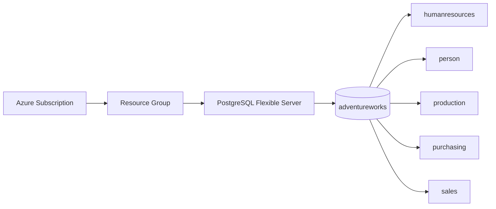

# AdventureWorks for Azure Database for PostgreSQL

Deploy the Microsoft AdventureWorks 2016 sample database to Azure Database for PostgreSQL Flexible Server.

## What You Get

AdventureWorks is a realistic, multi-table business database originally created by Microsoft for SQL Server and converted here to PostgreSQL format. It contains five schemas modelling a fictitious bicycle manufacturer:



- **HumanResources** — Employees, departments, job history
- **Person** — Contacts, addresses, contact types
- **Production** — Products, categories, inventory
- **Purchasing** — Vendors, purchase orders
- **Sales** — Orders, customers, territories

## Prerequisites

- **Azure subscription** with permissions to create resources
- One of the following to provision the server:
  - **PowerShell 5.1+ or 7+** with the Az.PostgreSql module (`Install-Module Az.PostgreSql`)
  - **Azure CLI** (`az`) for Mac/Linux users
- **psql** (PostgreSQL command-line client) — included with [pgAdmin 4](https://www.pgadmin.org/download/) or any PostgreSQL installation
- **pg_restore** — included with the same PostgreSQL installation as psql

> **⚠️ Azure Cost Warning:** Running an Azure Database for PostgreSQL Flexible Server incurs charges. A Burstable B1ms instance costs approximately $12–15/month. Remember to delete the resource group when finished to avoid ongoing charges.

## Quick Start (Experienced Users)

For users familiar with Azure and PostgreSQL — deploy in ~10 minutes:

**Option A: All-in-one script (recommended)**

```powershell
git clone https://github.com/JoshLuedeman/postgresql-adventureworks.git
cd postgresql-adventureworks

# PowerShell — single command handles everything
./Deploy-AdventureWorks.ps1 -ServerName "myawserver" -AdminPassword "YourSecureP@ssw0rd!"
```

```bash
# Or Bash/Mac/Linux — same thing with Azure CLI
./deploy-adventureworks.sh --server-name myawserver --admin-password 'YourSecureP@ssw0rd!'
```

**Option B: Manual step-by-step**

```powershell
# 1. Clone the repository
git clone https://github.com/JoshLuedeman/postgresql-adventureworks.git
cd postgresql-adventureworks

# 2. Provision the server (PowerShell)
. ./CreatePostgreSQLFlexibleServer.ps1

$server = create-AzPGFlexibleServer `
    -RGName "adventureworks-rg" `
    -Location "eastus" `
    -PGServerName "myawserver" `
    -PGAdminUserName "postgres" `
    -PGAdminPassword "YourSecureP@ssw0rd!" `
    -PGSkuTier "Burstable" `
    -PGSku "Standard_B1ms" `
    -PGVersion 16 `
    -PGStorageInMb 32768

# 3. Enable extensions in Azure Portal (see Step 2 below)

# 4. Create the database and restore
psql "host=$($server.FullyQualifiedDomainName) port=5432 dbname=postgres user=postgres" -c "CREATE DATABASE adventureworks;"
pg_restore -h $server.FullyQualifiedDomainName -U postgres -d adventureworks AdventureWorksPG.gz
```

Or with **Azure CLI** (Mac/Linux):

```bash
# Create the server
az postgres flexible-server create \
    --resource-group adventureworks-rg \
    --name myawserver \
    --admin-user postgres \
    --admin-password 'YourSecureP@ssw0rd!' \
    --location eastus \
    --sku-name Standard_B1ms \
    --tier Burstable \
    --version 16 \
    --storage-size 32 \
    --public-access 0.0.0.0

# Enable extensions, create the database, and restore
# (see Step 2 and Step 3 below)
```

## Step-by-Step Guide

### Step 1: Provision an Azure PostgreSQL Flexible Server

**Option A: PowerShell (recommended)**

```powershell
# Load the function
. ./CreatePostgreSQLFlexibleServer.ps1

# Set your parameters
$params = @{
    RGName          = "adventureworks-rg"
    Location        = "eastus"
    PGServerName    = "myawserver"
    PGAdminUserName = "postgres"    # ⚠️ MUST use "postgres" — see note below
    PGAdminPassword = "YourSecureP@ssw0rd!"
    PGSkuTier       = "Burstable"
    PGSku           = "Standard_B1ms"
    PGVersion       = 16
    PGStorageInMb   = 32768
}

$server = create-AzPGFlexibleServer @params
$serverFQDN = $server.FullyQualifiedDomainName
```

The script will create the resource group (if it doesn't exist), provision the server, and add a firewall rule for your current IP address.


**Option B: Azure Portal or Azure CLI**

Create the server through the [Azure Portal](https://portal.azure.com) or using `az postgres flexible-server create`. Ensure you note the fully qualified domain name (e.g., `myawserver.postgres.database.azure.com`).

> **⚠️ Important:** Use `postgres` as the admin username. The AdventureWorks backup was created with `postgres` owning all objects. Using a different username will cause permission errors during restore.

### Step 2: Enable PostgreSQL Extensions

1. Open the [Azure Portal](https://portal.azure.com)
2. Navigate to your PostgreSQL Flexible Server → **Server parameters**
3. Search for `azure.extensions`
4. Enable: **TABLEFUNC** and **UUID-OSSP**
5. Click **Save** (the server will restart)


### Step 3: Create the Database and Restore

```bash
# Connect to the server
psql "host=YOUR_SERVER.postgres.database.azure.com port=5432 dbname=postgres user=postgres"

# Create the database
CREATE DATABASE adventureworks;
\q

# Restore the backup (from your local machine)
pg_restore -h YOUR_SERVER.postgres.database.azure.com -U postgres -d adventureworks AdventureWorksPG.gz
```


> **Note:** The restore will output 2 Azure extension-related errors. These are safe to ignore — they don't affect data or schema integrity.

### Step 4: Verify the Restore

```bash
psql "host=YOUR_SERVER.postgres.database.azure.com port=5432 dbname=adventureworks user=postgres"

# Check that tables exist
SELECT schemaname, COUNT(*) as table_count
FROM pg_tables
WHERE schemaname IN ('humanresources','person','production','purchasing','sales')
GROUP BY schemaname
ORDER BY schemaname;

# Verify data was loaded
SELECT COUNT(*) FROM sales.salesorderheader;  -- Should return 31,465 rows
```

### Step 5: Connect with pgAdmin (Optional)

1. Open pgAdmin 4
2. Right-click **Servers** → **Register** → **Server**
3. Enter your server's FQDN, username (`postgres`), and password
4. Expand the database to explore the AdventureWorks tables


## Verification with Make

The included Makefile provides helper targets:

```bash
make restore     # Show the pg_restore command
make verify      # Show verification queries
make provision   # Show the provisioning command
make check       # Run pre-commit hooks (if installed)
make clean       # Remove temporary files
make help        # List all available targets
```

Override connection defaults with environment variables:

```bash
make restore PGHOST=myawserver.postgres.database.azure.com PGUSER=postgres
```

## Troubleshooting

| Problem | Solution |
|---------|----------|
| `pg_restore: command not found` | Add PostgreSQL bin directory to your PATH. On Windows: `C:\Program Files\PostgreSQL\16\bin` |
| `could not connect to server` | Check your firewall rules in Azure Portal. Ensure your IP is allowed. |
| `extension "tablefunc" is not available` | Enable TABLEFUNC in Azure Portal → Server parameters → azure.extensions |
| `role "postgres" does not exist` | You must use `postgres` as the admin username when creating the server |
| `permission denied for schema` | The restore must run as the `postgres` user |
| Azure extension errors during restore | Safe to ignore — Azure doesn't support all extensions |
| `password authentication failed` | Verify your password meets Azure complexity requirements (8+ chars, mixed case, numbers, special) |

## Cleanup

To avoid ongoing Azure charges, delete the resource group when finished:

```powershell
Remove-AzResourceGroup -Name "adventureworks-rg" -Force
```

Or with Azure CLI:

```bash
az group delete --name adventureworks-rg --yes --no-wait
```

## About This Repository

This repository serves as both a database deployment tool and a demonstration of the [Teamwork](https://github.com/JoshLuedeman/teamwork) agent-native development framework. The framework files (`.github/agents/`, `.github/skills/`, `.teamwork/`, `docs/`) provide structured AI-human collaboration through defined roles and workflows.

- **Database users:** You only need the README, the PowerShell script, and `AdventureWorksPG.gz`.
- **Framework users:** See [MEMORY.md](MEMORY.md) for full project context and framework documentation.

## License

This project is licensed under the MIT License — see the [LICENSE](LICENSE) file for details.

The AdventureWorks sample data is provided by Microsoft under public domain terms.